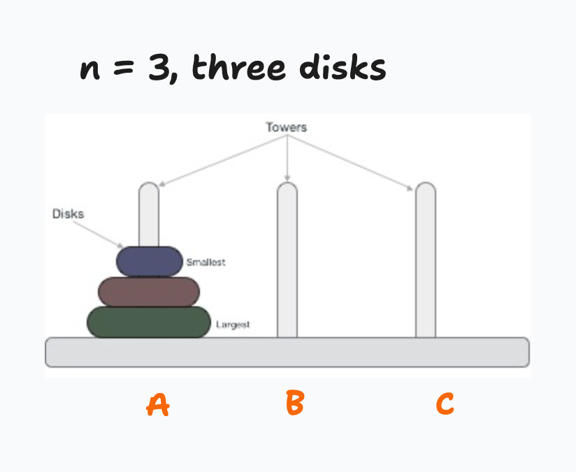

# Data Structures Culminating Exercise

This culminating exercise is a challenge for you to practice, reinforce, and deepen your data structures & algorithms knowledge. 

**IT IS NOT AN ASSESSMENT**, and, is a "stretch" challenge. It is OK if this is a challenging exercise. That is the point. We will review it later as a class.

**Please do not find and use an online solution to this problem.** Try to get as far as you can on your own, that is the point of this exercise. We will then review and study it as a class.

## Hanoi Towers, aka The Tower of Hanoi

Hanoi Towers, or the Tower of Hanoi is a classic programming problem for learning how to write recursive algorithms.

The Tower of Hanoi is a mathematical puzzle where we have three rods (also called "stacks" or "towers") and n disks. The objective of the puzzle is to move the entire stack to another rod, obeying the following simple rules:

1) Only one disk can be moved at a time.
2) Each move consists of taking the upper disk from one of the stacks and placing it on top of another stack - a disk can only be moved if it is the uppermost disk on a stack.
3) No disk may be placed on top of a smaller disk.

### Example of Tower of Hanoi with 3 disks



### Example of Tower of Hanoi with 8 disks


### Animated example of solving Tower of Hanoi with 3 disks


Let's call the rod the disks begin on the *source* rod. The rod we want them all to end up at is the *destination* rod. The other rod, the one used for "intermediate steps", lets call the *auxilary* rod.

In the animated example above, rod "A" is our *source* rod, and the middle rod "B" is our *destination* rod.

But rod "C" could have also been our destination rod, and, we still could have used the same approach to solve the problem!

## Instructions

Your task is to write a **recursive** function that solves the Tower of Hanoi puzzle for a given number of disks. Guide code for this function is in `hanoi.py`, and looks like this:

```python
def tower_of_hanoi(n, source, auxiliary, destination, moves_list):
    pass
```

The function should take three parameters:

n: The number of disks to be moved.
source: The rod from which disks should be moved.
auxiliary: The "intermediate" or "placeholder" rod we can put disks on as we eventually move them all from "source" to "destination"
destination: The rod to which disks should be moved.
moves_list: A python list containing each "move".

A "move" looks like this: "Move disk 1 from A to B", "Move disk 3 from B to C", etc.

See the function docstring comment in tower_of_hanoi.py and the tests.py file for details.

Your function must return the list of moves.

You are **not** allowed to use for loops, while loops, or any other sort of loop.

You are **not** allowed to create any other functions.

Your submission should only contain the implementation of the hanoi function.

## Advice on How to Solve This Problem

The way to solve this problem is to break it down into smaller, easier-to-solve subproblems. This problem-solving strategy is referred to as *"Divide and Conquer"* and is a useful strategy for all sorts of algorithm design.

### First solve for 0 disks

When there are 0 disks, there is nothing to do! Why do we need to solve for this? Because every recursive algorithm needs a **base case**. Remember, the base case is "when we want to break our loop", or, "when we are done". When are we done? When there are no disks left to move.

This is our base case.

### Now solve for 1 disk

First, write your function that successfully moves just one disk from a *source* to a *destination* rod. That's right - just one disk.

### Then solve for 2 disks

Now, update your function to move a stack of *two* disks on top of each other from a *source* to a *destination* rod.

### Now, solve for 3 disks

Next update your function to do the same for 3 disks.

### Each problem has an easier *subproblem*

Transferring 3 disks can be solved by solving the *subproblem* of transferring 2 disks, which can be solved by solving the *subproblem* of transferring 1 disk -- which itself can be solved by solving the very easy subproblem of transferring 0 disks!


### Now, solve for 4 disks, 5 disks, etc...

Transferring **4 disks** can be solved by solving the subproblem of transferring 3 disks, which is solved by solving the subproblem of transferring 2 disks, which is solved by the subproblem of transferring 1 disk, which is solved by the subproblem of transferring 0 disks.

**Transferring a stack of n disks can be solved by solving the subproblem of transferring the top n-1 disks from Source rod to Auxiliary rod.**